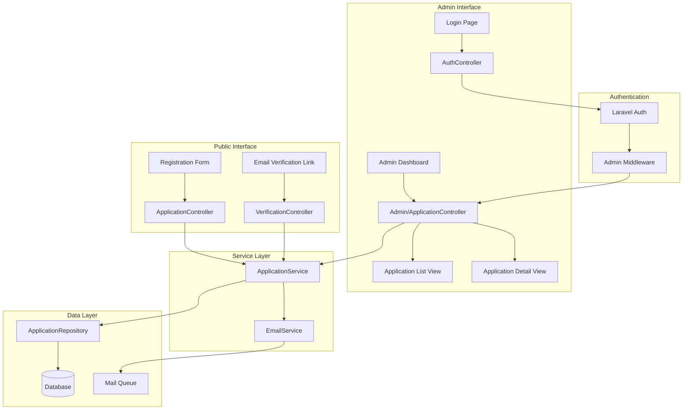
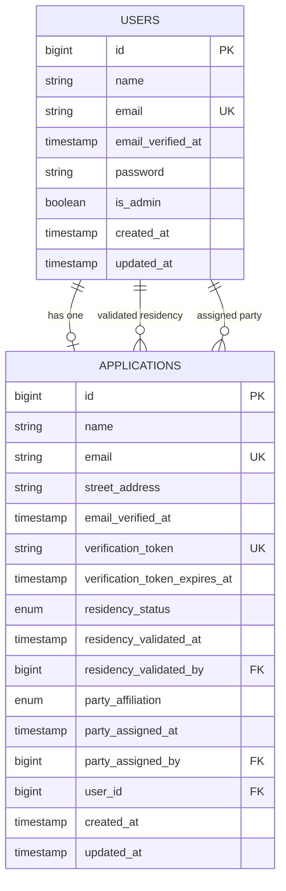

# Design Document

## Overview

The Poll Worker Sign-up System is a Laravel 12 application that manages the registration and administration of poll workers for Warren, CT. The system consists of two primary user interfaces: a public-facing registration form for applicants and an authenticated admin dashboard for managing applications. The architecture follows Laravel best practices with a service layer pattern, repository pattern for data access, and clear separation between public and admin functionality.

## Architecture

### High-Level Architecture



### Technology Stack

- Laravel 12 with PHP 8.4
- SQLite/MySQL database via DDEV
- Laravel's built-in authentication system
- Laravel Mail with queue support
- Blade templating with Tailwind CSS 4
- Vite for asset bundling

### Application Flow

1. **Public Registration Flow**
   - Applicant visits public registration page
   - Submits form with name, email, street address
   - System validates and stores application
   - System sends verification email
   - Applicant clicks verification link
   - System creates user account and marks email as verified

2. **Admin Management Flow**
   - Admin logs in via authentication page
   - Views dashboard overview with statistics on applications needing review
   - Navigates to application list (optionally filtered)
   - Filters/searches applications
   - Selects application to view details
   - Validates residency status
   - Assigns political party
   - Edits or deletes applications as needed
   - Exports all applications to CSV for external analysis

## Components and Interfaces

### Models

#### Application Model
Represents a poll worker application with the following attributes:

```php
<?php

declare(strict_types=1);

namespace App\Models;

use Illuminate\Database\Eloquent\Model;
use Illuminate\Database\Eloquent\Relations\BelongsTo;

class Application extends Model
{
    protected $fillable = [
        'name',
        'email',
        'street_address',
        'email_verified_at',
        'verification_token',
        'verification_token_expires_at',
        'residency_status', // enum: pending, approved, rejected
        'residency_validated_at',
        'residency_validated_by',
        'party_affiliation', // enum: democrat, republican, independent, unaffiliated, null
        'party_assigned_at',
        'party_assigned_by',
        'user_id', // nullable, set after email verification
    ];

    protected $casts = [
        'email_verified_at' => 'datetime',
        'verification_token_expires_at' => 'datetime',
        'residency_validated_at' => 'datetime',
        'party_assigned_at' => 'datetime',
    ];

    public function user(): BelongsTo
    {
        return $this->belongsTo(User::class);
    }

    public function residencyValidator(): BelongsTo
    {
        return $this->belongsTo(User::class, 'residency_validated_by');
    }

    public function partyAssigner(): BelongsTo
    {
        return $this->belongsTo(User::class, 'party_assigned_by');
    }

    public function isEmailVerified(): bool
    {
        return $this->email_verified_at !== null;
    }

    public function isResidencyApproved(): bool
    {
        return $this->residency_status === 'approved';
    }

    public function hasPartyAssignment(): bool
    {
        return $this->party_affiliation !== null;
    }
}
```

#### User Model
Extended Laravel User model for both applicants and admins:

```php
<?php

declare(strict_types=1);

namespace App\Models;

use Illuminate\Foundation\Auth\User as Authenticatable;
use Illuminate\Database\Eloquent\Relations\HasOne;

class User extends Authenticatable
{
    protected $fillable = [
        'name',
        'email',
        'password',
        'is_admin',
    ];

    protected $hidden = [
        'password',
        'remember_token',
    ];

    protected $casts = [
        'email_verified_at' => 'datetime',
        'is_admin' => 'boolean',
    ];

    public function application(): HasOne
    {
        return $this->hasOne(Application::class);
    }

    public function isAdmin(): bool
    {
        return $this->is_admin === true;
    }
}
```

### Enums

#### ResidencyStatus Enum
```php
<?php

declare(strict_types=1);

namespace App\Enums;

enum ResidencyStatus: string
{
    case PENDING = 'pending';
    case APPROVED = 'approved';
    case REJECTED = 'rejected';
}
```

#### PartyAffiliation Enum
```php
<?php

declare(strict_types=1);

namespace App\Enums;

enum PartyAffiliation: string
{
    case DEMOCRAT = 'democrat';
    case REPUBLICAN = 'republican';
    case INDEPENDENT = 'independent';
    case UNAFFILIATED = 'unaffiliated';
}
```

### Controllers

#### ApplicationController (Public)
Handles public-facing registration:

```php
<?php

declare(strict_types=1);

namespace App\Http\Controllers;

use App\Services\ApplicationService;
use Illuminate\Http\Request;
use Illuminate\View\View;
use Illuminate\Http\RedirectResponse;

class ApplicationController extends Controller
{
    public function __construct(
        private ApplicationService $applicationService
    ) {}

    public function create(): View
    {
        return view('applications.create');
    }

    public function store(Request $request): RedirectResponse
    {
        $validated = $request->validate([
            'name' => 'required|string|max:255',
            'email' => 'required|email|unique:applications,email',
            'street_address' => 'required|string|max:500',
        ]);

        $this->applicationService->createApplication($validated);

        return redirect()
            ->route('applications.create')
            ->with('success', 'Registration submitted! Please check your email to verify your address.');
    }
}
```

#### VerificationController
Handles email verification:

```php
<?php

declare(strict_types=1);

namespace App\Http\Controllers;

use App\Services\ApplicationService;
use Illuminate\Http\Request;
use Illuminate\Http\RedirectResponse;

class VerificationController extends Controller
{
    public function __construct(
        private ApplicationService $applicationService
    ) {}

    public function verify(Request $request, string $token): RedirectResponse
    {
        $result = $this->applicationService->verifyEmail($token);

        if ($result) {
            return redirect()
                ->route('verification.success')
                ->with('success', 'Email verified successfully!');
        }

        return redirect()
            ->route('verification.expired')
            ->with('error', 'Verification link has expired or is invalid.');
    }
}
```

#### Admin\ApplicationController
Handles admin CRUD operations:

```php
<?php

declare(strict_types=1);

namespace App\Http\Controllers\Admin;

use App\Http\Controllers\Controller;
use App\Services\ApplicationService;
use Illuminate\Http\Request;
use Illuminate\View\View;
use Illuminate\Http\RedirectResponse;
use Symfony\Component\HttpFoundation\StreamedResponse;

class ApplicationController extends Controller
{
    public function __construct(
        private ApplicationService $applicationService
    ) {}

    public function dashboard(): View
    {
        $stats = $this->applicationService->getDashboardStats();

        return view('admin.dashboard', compact('stats'));
    }

    public function index(Request $request): View
    {
        $filters = $request->only(['search', 'residency_status', 'party_affiliation', 'email_verified']);
        $applications = $this->applicationService->getFilteredApplications($filters);

        return view('admin.applications.index', compact('applications'));
    }

    public function show(int $id): View
    {
        $application = $this->applicationService->getApplicationById($id);

        return view('admin.applications.show', compact('application'));
    }

    public function edit(int $id): View
    {
        $application = $this->applicationService->getApplicationById($id);

        return view('admin.applications.edit', compact('application'));
    }

    public function update(Request $request, int $id): RedirectResponse
    {
        $validated = $request->validate([
            'name' => 'required|string|max:255',
            'email' => 'required|email',
            'street_address' => 'required|string|max:500',
        ]);

        $this->applicationService->updateApplication($id, $validated);

        return redirect()
            ->route('admin.applications.show', $id)
            ->with('success', 'Application updated successfully.');
    }

    public function destroy(int $id): RedirectResponse
    {
        $this->applicationService->deleteApplication($id);

        return redirect()
            ->route('admin.applications.index')
            ->with('success', 'Application deleted successfully.');
    }

    public function updateResidency(Request $request, int $id): RedirectResponse
    {
        $validated = $request->validate([
            'residency_status' => 'required|in:approved,rejected',
        ]);

        $this->applicationService->updateResidencyStatus(
            $id,
            $validated['residency_status'],
            auth()->id()
        );

        return back()->with('success', 'Residency status updated.');
    }

    public function updateParty(Request $request, int $id): RedirectResponse
    {
        $validated = $request->validate([
            'party_affiliation' => 'required|in:democrat,republican,independent,unaffiliated',
        ]);

        $this->applicationService->updatePartyAffiliation(
            $id,
            $validated['party_affiliation'],
            auth()->id()
        );

        return back()->with('success', 'Party affiliation updated.');
    }

    public function resendVerification(int $id): RedirectResponse
    {
        $this->applicationService->resendVerificationEmail($id);

        return back()->with('success', 'Verification email resent.');
    }

    public function export(): StreamedResponse
    {
        return $this->applicationService->exportApplicationsToCSV();
    }
}
```

### Services

#### ApplicationService
Encapsulates business logic for application management:

```php
<?php

declare(strict_types=1);

namespace App\Services;

use App\Models\Application;
use App\Repositories\ApplicationRepository;
use Illuminate\Support\Str;
use Illuminate\Support\Facades\DB;
use Carbon\Carbon;

class ApplicationService
{
    public function __construct(
        private ApplicationRepository $applicationRepository,
        private EmailService $emailService
    ) {}

    public function createApplication(array $data): Application
    {
        return DB::transaction(function () use ($data) {
            $application = $this->applicationRepository->create([
                'name' => $data['name'],
                'email' => $data['email'],
                'street_address' => $data['street_address'],
                'verification_token' => Str::random(64),
                'verification_token_expires_at' => Carbon::now()->addHours(48),
                'residency_status' => 'pending',
            ]);

            $this->emailService->sendVerificationEmail($application);

            return $application;
        });
    }

    public function verifyEmail(string $token): bool
    {
        $application = $this->applicationRepository->findByVerificationToken($token);

        if (!$application || $application->verification_token_expires_at < Carbon::now()) {
            return false;
        }

        return DB::transaction(function () use ($application) {
            // Create user account
            $user = User::create([
                'name' => $application->name,
                'email' => $application->email,
                'password' => Hash::make(Str::random(32)), // Random password, user won't log in
                'is_admin' => false,
            ]);

            // Update application
            $this->applicationRepository->update($application->id, [
                'email_verified_at' => Carbon::now(),
                'verification_token' => null,
                'verification_token_expires_at' => null,
                'user_id' => $user->id,
            ]);

            return true;
        });
    }

    public function getFilteredApplications(array $filters): mixed
    {
        return $this->applicationRepository->getFiltered($filters);
    }

    public function getApplicationById(int $id): Application
    {
        return $this->applicationRepository->findById($id);
    }

    public function updateApplication(int $id, array $data): Application
    {
        return $this->applicationRepository->update($id, $data);
    }

    public function deleteApplication(int $id): bool
    {
        return DB::transaction(function () use ($id) {
            $application = $this->applicationRepository->findById($id);
            
            // Delete associated user if exists
            if ($application->user_id) {
                $application->user()->delete();
            }
            
            return $this->applicationRepository->delete($id);
        });
    }

    public function updateResidencyStatus(int $id, string $status, int $validatorId): Application
    {
        return $this->applicationRepository->update($id, [
            'residency_status' => $status,
            'residency_validated_at' => Carbon::now(),
            'residency_validated_by' => $validatorId,
        ]);
    }

    public function updatePartyAffiliation(int $id, string $party, int $assignerId): Application
    {
        return $this->applicationRepository->update($id, [
            'party_affiliation' => $party,
            'party_assigned_at' => Carbon::now(),
            'party_assigned_by' => $assignerId,
        ]);
    }

    public function resendVerificationEmail(int $id): void
    {
        $application = $this->applicationRepository->findById($id);

        // Generate new token
        $this->applicationRepository->update($id, [
            'verification_token' => Str::random(64),
            'verification_token_expires_at' => Carbon::now()->addHours(48),
        ]);

        $application->refresh();
        $this->emailService->sendVerificationEmail($application);
    }

    public function getDashboardStats(): array
    {
        return [
            'pending_residency' => $this->applicationRepository->countByResidencyStatus('pending'),
            'verified_awaiting_approval' => $this->applicationRepository->countVerifiedAwaitingApproval(),
            'approved_no_party' => $this->applicationRepository->countApprovedWithoutParty(),
            'total_applications' => $this->applicationRepository->countTotal(),
        ];
    }

    public function exportApplicationsToCSV(): StreamedResponse
    {
        $applications = $this->applicationRepository->getAllForExport();

        $headers = [
            'Content-Type' => 'text/csv',
            'Content-Disposition' => 'attachment; filename="poll-workers-' . date('Y-m-d') . '.csv"',
        ];

        $callback = function () use ($applications) {
            $file = fopen('php://output', 'w');

            // CSV header row
            fputcsv($file, [
                'ID',
                'Name',
                'Email',
                'Street Address',
                'Email Verified',
                'Email Verified At',
                'Residency Status',
                'Residency Validated At',
                'Residency Validated By',
                'Party Affiliation',
                'Party Assigned At',
                'Party Assigned By',
                'Created At',
                'Updated At',
            ]);

            // Data rows
            foreach ($applications as $app) {
                fputcsv($file, [
                    $app->id,
                    $app->name,
                    $app->email,
                    $app->street_address,
                    $app->email_verified_at ? 'Yes' : 'No',
                    $app->email_verified_at?->format('Y-m-d H:i:s'),
                    $app->residency_status,
                    $app->residency_validated_at?->format('Y-m-d H:i:s'),
                    $app->residencyValidator?->name,
                    $app->party_affiliation,
                    $app->party_assigned_at?->format('Y-m-d H:i:s'),
                    $app->partyAssigner?->name,
                    $app->created_at->format('Y-m-d H:i:s'),
                    $app->updated_at->format('Y-m-d H:i:s'),
                ]);
            }

            fclose($file);
        };

        return response()->stream($callback, 200, $headers);
    }
}
```

#### EmailService
Handles email sending operations:

```php
<?php

declare(strict_types=1);

namespace App\Services;

use App\Models\Application;
use App\Mail\VerificationEmail;
use Illuminate\Support\Facades\Mail;

class EmailService
{
    public function sendVerificationEmail(Application $application): void
    {
        Mail::to($application->email)
            ->queue(new VerificationEmail($application));
    }
}
```

### Repositories

#### ApplicationRepository
Abstracts data access for applications:

```php
<?php

declare(strict_types=1);

namespace App\Repositories;

use App\Models\Application;
use Illuminate\Pagination\LengthAwarePaginator;

class ApplicationRepository
{
    public function create(array $data): Application
    {
        return Application::create($data);
    }

    public function findById(int $id): Application
    {
        return Application::with(['user', 'residencyValidator', 'partyAssigner'])
            ->findOrFail($id);
    }

    public function findByVerificationToken(string $token): ?Application
    {
        return Application::where('verification_token', $token)->first();
    }

    public function update(int $id, array $data): Application
    {
        $application = Application::findOrFail($id);
        $application->update($data);
        return $application->fresh();
    }

    public function delete(int $id): bool
    {
        return Application::findOrFail($id)->delete();
    }

    public function getFiltered(array $filters): LengthAwarePaginator
    {
        $query = Application::with(['user', 'residencyValidator', 'partyAssigner']);

        if (!empty($filters['search'])) {
            $search = $filters['search'];
            $query->where(function ($q) use ($search) {
                $q->where('name', 'like', "%{$search}%")
                  ->orWhere('email', 'like', "%{$search}%")
                  ->orWhere('street_address', 'like', "%{$search}%");
            });
        }

        if (!empty($filters['residency_status'])) {
            $query->where('residency_status', $filters['residency_status']);
        }

        if (!empty($filters['party_affiliation'])) {
            $query->where('party_affiliation', $filters['party_affiliation']);
        }

        if (isset($filters['email_verified'])) {
            if ($filters['email_verified'] === 'yes') {
                $query->whereNotNull('email_verified_at');
            } else {
                $query->whereNull('email_verified_at');
            }
        }

        return $query->orderBy('created_at', 'desc')->paginate(20);
    }

    public function countByResidencyStatus(string $status): int
    {
        return Application::where('residency_status', $status)->count();
    }

    public function countVerifiedAwaitingApproval(): int
    {
        return Application::whereNotNull('email_verified_at')
            ->where('residency_status', 'pending')
            ->count();
    }

    public function countApprovedWithoutParty(): int
    {
        return Application::where('residency_status', 'approved')
            ->whereNull('party_affiliation')
            ->count();
    }

    public function countTotal(): int
    {
        return Application::count();
    }

    public function getAllForExport(): Collection
    {
        return Application::with(['residencyValidator', 'partyAssigner'])
            ->orderBy('created_at', 'desc')
            ->get();
    }
}
```

### Middleware

#### AdminMiddleware
Restricts access to admin routes:

```php
<?php

declare(strict_types=1);

namespace App\Http\Middleware;

use Closure;
use Illuminate\Http\Request;
use Symfony\Component\HttpFoundation\Response;

class AdminMiddleware
{
    public function handle(Request $request, Closure $next): Response
    {
        if (!auth()->check() || !auth()->user()->isAdmin()) {
            abort(403, 'Unauthorized access.');
        }

        return $next($request);
    }
}
```

### Mail Classes

#### VerificationEmail
Mailable for email verification:

```php
<?php

declare(strict_types=1);

namespace App\Mail;

use App\Models\Application;
use Illuminate\Bus\Queueable;
use Illuminate\Mail\Mailable;
use Illuminate\Queue\SerializesModels;

class VerificationEmail extends Mailable
{
    use Queueable, SerializesModels;

    public function __construct(
        public Application $application
    ) {}

    public function build(): self
    {
        $verificationUrl = route('verification.verify', [
            'token' => $this->application->verification_token
        ]);

        return $this->subject('Verify Your Poll Worker Registration')
            ->view('emails.verification')
            ->with([
                'name' => $this->application->name,
                'verificationUrl' => $verificationUrl,
            ]);
    }
}
```

### Views

#### Admin Dashboard (admin.dashboard)
The dashboard overview displays key statistics and quick navigation:

- **Statistics Cards**: Display counts for:
  - Total applications
  - Pending residency validation
  - Verified applications awaiting approval
  - Approved residents without party assignment
- **Quick Links**: Each statistic card links to a filtered view of the application list
- **Navigation**: Links to full application list and other admin functions

#### Application List (admin.applications.index)
The application list view includes:

- **Export Button**: Prominent button to download CSV file of all applications
- **Filter Controls**: Search box and dropdown filters for residency status, party affiliation, and verification status
- **Application Table**: Displays all applications with key information
- **Pagination**: Shows 20 applications per page

#### CSV Export Format
The exported CSV file includes the following columns:
- ID
- Name
- Email
- Street Address
- Email Verified (Yes/No)
- Email Verified At (timestamp)
- Residency Status
- Residency Validated At (timestamp)
- Residency Validated By (admin name)
- Party Affiliation
- Party Assigned At (timestamp)
- Party Assigned By (admin name)
- Created At (timestamp)
- Updated At (timestamp)

## Data Models

### Database Schema

#### applications table
```sql
CREATE TABLE applications (
    id BIGINT UNSIGNED AUTO_INCREMENT PRIMARY KEY,
    name VARCHAR(255) NOT NULL,
    email VARCHAR(255) NOT NULL UNIQUE,
    street_address VARCHAR(500) NOT NULL,
    email_verified_at TIMESTAMP NULL,
    verification_token VARCHAR(64) NULL UNIQUE,
    verification_token_expires_at TIMESTAMP NULL,
    residency_status ENUM('pending', 'approved', 'rejected') DEFAULT 'pending',
    residency_validated_at TIMESTAMP NULL,
    residency_validated_by BIGINT UNSIGNED NULL,
    party_affiliation ENUM('democrat', 'republican', 'independent', 'unaffiliated') NULL,
    party_assigned_at TIMESTAMP NULL,
    party_assigned_by BIGINT UNSIGNED NULL,
    user_id BIGINT UNSIGNED NULL,
    created_at TIMESTAMP DEFAULT CURRENT_TIMESTAMP,
    updated_at TIMESTAMP DEFAULT CURRENT_TIMESTAMP ON UPDATE CURRENT_TIMESTAMP,
    
    FOREIGN KEY (user_id) REFERENCES users(id) ON DELETE SET NULL,
    FOREIGN KEY (residency_validated_by) REFERENCES users(id) ON DELETE SET NULL,
    FOREIGN KEY (party_assigned_by) REFERENCES users(id) ON DELETE SET NULL,
    
    INDEX idx_email (email),
    INDEX idx_verification_token (verification_token),
    INDEX idx_residency_status (residency_status),
    INDEX idx_party_affiliation (party_affiliation)
);
```

#### users table (extended)
```sql
CREATE TABLE users (
    id BIGINT UNSIGNED AUTO_INCREMENT PRIMARY KEY,
    name VARCHAR(255) NOT NULL,
    email VARCHAR(255) NOT NULL UNIQUE,
    email_verified_at TIMESTAMP NULL,
    password VARCHAR(255) NOT NULL,
    is_admin BOOLEAN DEFAULT FALSE,
    remember_token VARCHAR(100) NULL,
    created_at TIMESTAMP DEFAULT CURRENT_TIMESTAMP,
    updated_at TIMESTAMP DEFAULT CURRENT_TIMESTAMP ON UPDATE CURRENT_TIMESTAMP,
    
    INDEX idx_email (email),
    INDEX idx_is_admin (is_admin)
);
```

### Entity Relationships



## Error Handling

### Validation Errors
- Form validation uses Laravel's built-in validation with custom error messages
- Validation errors are displayed inline on forms using Blade's `@error` directive
- Failed validation returns user to form with old input preserved

### Application Errors
- Email already exists: Display error message on registration form
- Verification token expired: Redirect to expired page with option to request new link
- Unauthorized access: Return 403 Forbidden for non-admin users accessing admin routes
- Application not found: Return 404 Not Found with appropriate error page
- Database errors: Log error and display generic error message to user

### Email Delivery Errors
- Queue failed jobs for retry (configured in queue settings)
- Log email failures for admin review
- Provide manual resend option in admin interface

## Testing Strategy

### Unit Tests
- Model methods (isEmailVerified, isResidencyApproved, hasPartyAssignment)
- Service layer methods (createApplication, verifyEmail, updateResidencyStatus)
- Repository methods (create, findById, getFiltered)
- Enum cases and values

### Feature Tests
- Public registration flow
  - Submit valid application
  - Submit duplicate email
  - Submit invalid data
- Email verification flow
  - Verify with valid token
  - Verify with expired token
  - Verify with invalid token
- Admin authentication
  - Login with valid credentials
  - Login with invalid credentials
  - Access admin routes without authentication
- Admin dashboard
  - View dashboard statistics
  - Navigate to filtered application lists from dashboard
- Admin CRUD operations
  - View application list
  - Filter and search applications
  - View application details
  - Update application
  - Delete application
  - Update residency status
  - Assign party affiliation
  - Resend verification email
  - Export applications to CSV

### Integration Tests
- Complete registration to verification flow
- Admin workflow from login to application management
- Email queue processing

### Browser Tests (Optional)
- End-to-end user registration flow
- Admin dashboard interactions
- Form validation and error display

## Security Considerations

### Authentication & Authorization
- Admin routes protected by authentication middleware and AdminMiddleware
- CSRF protection on all forms
- Password hashing using Laravel's Hash facade
- Session-based authentication with secure cookies

### Data Validation
- Server-side validation on all inputs
- Email format validation
- Unique email constraint at database level
- SQL injection prevention via Eloquent ORM

### Email Security
- Verification tokens are random 64-character strings
- Tokens expire after 48 hours
- Tokens are single-use (cleared after verification)
- Previous tokens invalidated when resending

### Access Control
- Public routes: registration form, verification endpoint
- Admin-only routes: dashboard, CRUD operations, status updates
- Users cannot access other users' data
- Admins can only perform authorized actions

## Performance Considerations

### Database Optimization
- Indexes on frequently queried columns (email, verification_token, residency_status, party_affiliation)
- Eager loading relationships to prevent N+1 queries
- Pagination for application lists (20 per page)

### Email Queue
- Verification emails sent via queue to prevent blocking
- Queue worker processes jobs asynchronously
- Failed jobs automatically retried

### Caching Strategy
- No caching required for MVP (data changes frequently)
- Consider caching application counts for dashboard in future iterations

## Deployment Considerations

### Environment Configuration
- Configure mail driver (SMTP, Mailgun, etc.)
- Set APP_URL for correct verification link generation
- Configure queue driver (database for simplicity, Redis for production)
- Set session driver and lifetime

### Database Migrations
- Run migrations in order: users table modification, applications table creation
- Seed initial admin user for system access

### Queue Worker
- Ensure queue worker is running in production
- Configure supervisor or systemd for queue worker process management
- Monitor failed jobs queue

### Email Configuration
- Test email delivery in staging environment
- Configure SPF/DKIM records for email domain
- Set up email monitoring for delivery failures
