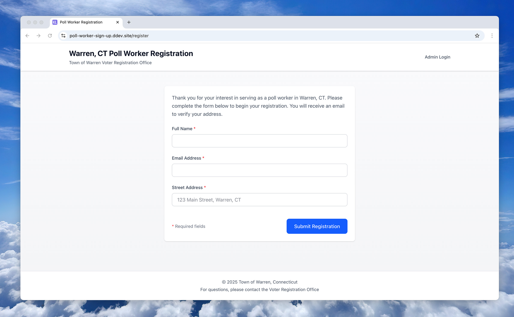
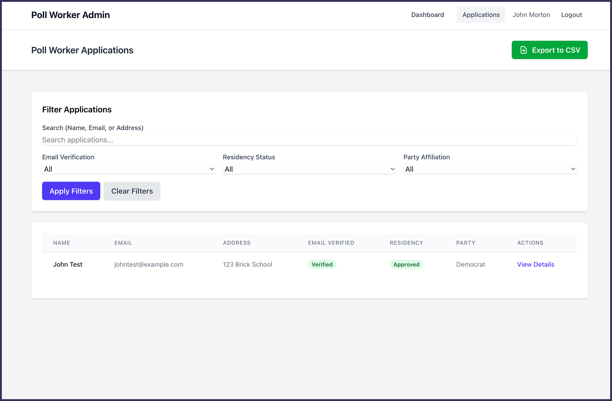

# About the Poll Worker Signup System

## Overview

The **Poll Worker Signup System** is a Laravel 12 web app designed to manage the registration and administration of poll workers for Warren, CT. This project was built using the [**Kiro Laravel Skeleton Template**](https://github.com/johnfmorton/kiro-laravel-skeleton), which provides a production-ready foundation with DDEV local development, Vite integration, and comprehensive steering documents.

## What This Application Does

This system serves two primary audiences:

### For Poll Worker Applicants (Public Interface)
- Submit registration applications with name, email, and street address
- Receive email verification to confirm identity
- Automatic account creation upon email verification



### For Voter Registrar Staff (Admin Interface)
- View dashboard with application statistics and quick filters
- Toggle public registration on/off as needed
- Review and manage all applications
- Validate residency status (approve/reject)
- Assign political party affiliations
- Edit or delete applications
- Resend verification emails
- Export all applications to CSV for external analysis



## Key Features

### Registration Toggle System
The voter registrar can enable or disable public registration at any time. When disabled:
- The registration form is displayed but all fields are disabled
- A message directs visitors to contact the registrar's office
- Server-side validation prevents automated submissions
- The system gracefully handles the transition between states

### Email Verification Flow
- Applications are not complete until email is verified
- Verification links expire after 48 hours
- Admins can resend verification emails if needed
- User accounts are automatically created upon verification

### Comprehensive Admin Dashboard
- Statistics cards showing applications needing attention
- Quick navigation to filtered application lists
- Registration toggle control prominently displayed
- Clean, intuitive interface built with Tailwind CSS

### CSV Export
Export all application data including:
- Applicant information
- Verification status and timestamps
- Residency validation details
- Party affiliation assignments
- Admin actions with timestamps and names

## Built on the Kiro Laravel Skeleton

This project leverages the Kiro Laravel Skeleton Template, which provides:

### Pre-configured Development Environment
- **DDEV Integration**: Complete Docker-based local development with PHP 8.4, MySQL 8.4, and nginx
- **Vite Setup**: Hot module reloading for efficient frontend development
- **Queue System**: Database-driven queues for asynchronous email sending
- **Makefile Commands**: Simple `make dev` and `make setup` commands for common tasks

### Comprehensive Steering Documents
The skeleton includes detailed guidance documents that shaped this project's architecture:
- **tech.md**: Technology stack and common commands
- **structure.md**: Project organization and naming conventions
- **laravel.md**: Laravel best practices and coding standards
- **ddev.md**: DDEV-specific workflows and commands
- **product.md**: Product overview and context

These steering documents ensure consistent code quality, proper architecture patterns, and maintainable code from day one.

### Production-Ready Foundation
- PSR-12 coding standards with Laravel Pint
- Strict typing throughout the codebase
- Service layer and repository patterns
- Comprehensive PHPDoc documentation
- Security best practices built-in

## Technology Stack

- **Framework**: Laravel 12 with PHP 8.4
- **Database**: SQLite (development) / MySQL 8.4 (production via DDEV)
- **Frontend**: Tailwind CSS 4 with Vite 7 for asset bundling
- **Authentication**: Laravel's built-in authentication system
- **Email**: Laravel Mail with queue support
- **Development**: DDEV for containerized local environment

## Architecture Highlights

### Clean Separation of Concerns
```
Public Interface → Controllers → Services → Repositories → Models → Database
Admin Interface  ↗
```

### Service Layer Pattern
Business logic is encapsulated in service classes:
- `ApplicationService`: Handles application lifecycle and business rules
- `EmailService`: Manages email sending operations

### Repository Pattern
Data access is abstracted through repositories:
- `ApplicationRepository`: Provides clean interface for application data operations
- Eager loading to prevent N+1 queries
- Filtering and pagination built-in

### Enums for Type Safety
- `ResidencyStatus`: PENDING, APPROVED, REJECTED
- `PartyAffiliation`: DEMOCRAT, REPUBLICAN, INDEPENDENT, UNAFFILIATED

## Project Structure

```
app/
├── Enums/                    # Type-safe enumerations
├── Http/
│   ├── Controllers/          # Public controllers
│   │   ├── ApplicationController.php
│   │   └── VerificationController.php
│   ├── Controllers/Admin/    # Admin controllers
│   │   └── ApplicationController.php
│   └── Middleware/
│       └── AdminMiddleware.php
├── Mail/
│   └── VerificationEmail.php
├── Models/
│   ├── Application.php
│   ├── Setting.php
│   └── User.php
├── Repositories/
│   └── ApplicationRepository.php
└── Services/
    ├── ApplicationService.php
    └── EmailService.php

resources/
├── css/
│   └── app.css              # Tailwind CSS
├── js/
│   └── app.js
└── views/
    ├── admin/               # Admin interface views
    ├── applications/        # Public registration views
    └── emails/              # Email templates

database/
├── migrations/              # Database schema
└── seeders/                 # Initial data (admin user)

tests/
├── Feature/                 # Feature tests
└── Unit/                    # Unit tests
```

## Getting Started

### Prerequisites
- Docker Desktop (for DDEV)
- Git

### Initial Setup

1. Clone the repository:
```bash
git clone <repository-url> poll-worker-signup
cd poll-worker-signup
```

2. Start DDEV:
```bash
ddev start
```

3. Run initial setup:
```bash
make setup
```

This command:
- Installs PHP dependencies via Composer
- Installs Node.js dependencies
- Generates application key
- Runs database migrations
- Seeds initial admin user
- Builds frontend assets

4. Start development environment:
```bash
make dev
```

This launches:
- Laravel development server
- Queue worker for email processing
- Laravel Pail for real-time logs
- Vite dev server with hot module reloading

### Default Admin Credentials

After running the seeder, you can log in with:
- **Email**: admin@example.com
- **Password**: password

**Important**: Change these credentials immediately in production!

## Development Workflow

### Daily Development
```bash
ddev start    # Start DDEV containers
make dev      # Launch development environment
```

### Running Tests
```bash
ddev composer test
# or
ddev artisan test
```

### Code Style
```bash
ddev exec ./vendor/bin/pint
```

### Database Operations
```bash
ddev artisan migrate              # Run migrations
ddev artisan migrate:fresh --seed # Fresh database with seeding
ddev artisan db:seed              # Run seeders only
```

### Queue Management
```bash
ddev artisan queue:work           # Start queue worker
ddev artisan queue:failed         # View failed jobs
ddev artisan queue:retry all      # Retry failed jobs
```

## Testing Strategy

The project includes comprehensive tests:

### Feature Tests
- Public registration flow (enabled and disabled states)
- Email verification process
- Admin authentication and authorization
- Admin CRUD operations
- Registration toggle functionality
- CSV export

### Property-Based Tests
Three key properties are tested with multiple iterations:
1. **Registration toggle updates database state**
2. **Form state matches registration status**
3. **Disabled registration rejects submissions**

### Unit Tests
- Model methods and relationships
- Service layer business logic
- Repository data access methods
- Enum values and cases

## Security Features

- **Authentication**: Session-based with secure cookies
- **Authorization**: Admin middleware protects sensitive routes
- **CSRF Protection**: All forms include CSRF tokens
- **Password Hashing**: Laravel's Hash facade with bcrypt
- **Email Verification**: Time-limited, single-use tokens
- **SQL Injection Prevention**: Eloquent ORM with parameter binding
- **Input Validation**: Server-side validation on all inputs

## Deployment Considerations

### Environment Configuration
Update `.env` for production:
- Set `APP_ENV=production`
- Configure mail driver (SMTP, Mailgun, SES, etc.)
- Set `APP_URL` for correct verification links
- Configure queue driver (Redis recommended for production)

### Queue Worker
Set up Supervisor to keep queue worker running:
```bash
ddev artisan queue:work --tries=3 --timeout=90
```

### Email Configuration
- Configure SPF/DKIM records for your domain
- Test email delivery in staging
- Monitor failed jobs queue

### Database
- Run migrations: `ddev artisan migrate --force`
- Seed admin user: `ddev artisan db:seed --class=AdminUserSeeder`

## Future Enhancements

Potential features for future iterations:
- Multi-factor authentication for admin users
- Advanced reporting and analytics
- SMS notifications in addition to email
- Applicant portal for status checking
- Automated residency validation via address APIs
- Bulk import/export functionality
- Audit log for all admin actions

## Contributing

This project follows Laravel best practices and PSR-12 coding standards. When contributing:

1. Run tests before submitting: `ddev composer test`
2. Format code with Pint: `ddev exec ./vendor/bin/pint`
3. Follow the patterns established in the codebase
4. Add tests for new features
5. Update documentation as needed

## License

This project is open source under the MIT License.

## Acknowledgments

Built with the [Kiro Laravel Skeleton Template](https://github.com/johnfmorton/kiro-laravel-skeleton), which provides a production-ready foundation for Laravel projects with DDEV, comprehensive steering documents, and best practices built-in.
